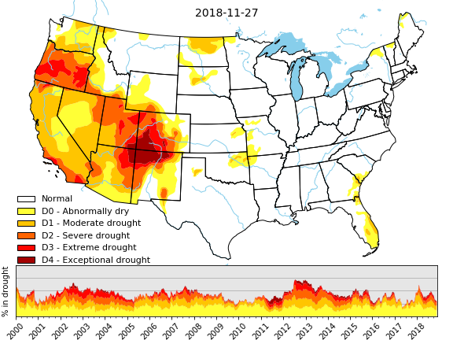
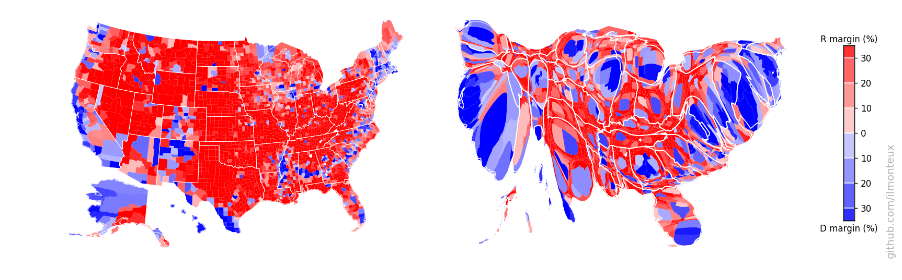

# Exploring maps

Playing with maps with different, loosely related short projects:

- [chronomaps](chronomaps): computing travel times from given location using the Google Maps API, generate isochrones (fixed travel time contours), and create maps where the radial distance from starting point is given by travel time instead.    

    

    Check out the discussion at [ilmonteux.github.io/chronomaps/](https://ilmonteux.github.io/chronomaps/)

- [Maps of drought conditions in the US](droughtmaps): visualize geospatial data from the [US drought monitor](https://droughtmonitor.unl.edu/).

    

    Check out the discussion at [ilmonteux.github.io/2018/12/03/drought-maps.html](https://ilmonteux.github.io/2018/12/03/drought-maps.html)

- [US election results](US_elections) at the county level, including cartograms, that is, maps based on population and not on land area. Resulting figures look like the following:

    Check out the discussion at [ilmonteux.github.io/cartograms/](https://ilmonteux.github.io/cartograms/)
