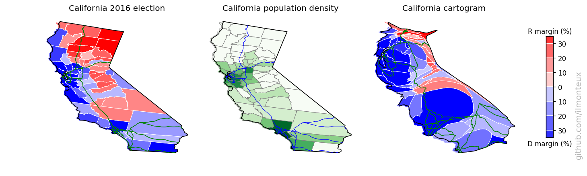
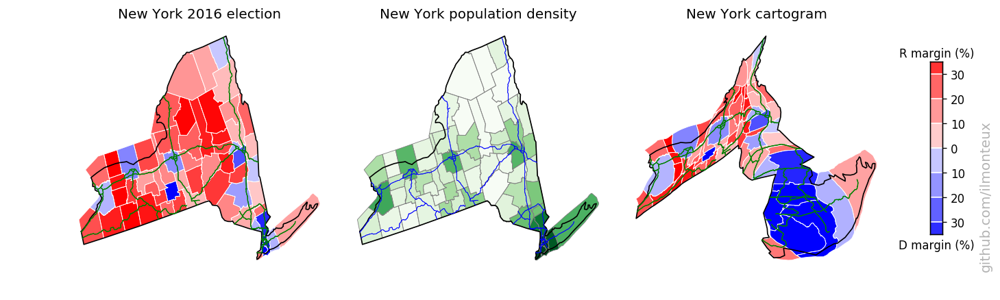

# Mapping US Elections

A short foray into data visualization, mapping and cartogramming, using the US presidential elections results.     
In addition to plotting the election results in the blue/red scheme at the state or county level, I create a cartogram, that is a morphed map where the **size** of each state or county is based on its population.

Head to the [github.io page](https://ilmonteux.github.io/cartograms/) for details and a tutorial.

Here is a sample of visualizations for the 2016 elections:   

You can find more plots in the [github.io page](https://ilmonteux.github.io/cartograms/), including state-level results, comparisons to the 2008 and 2012 elections, zoomed single-state cartograms and exploration of correlations between voting and demographics. The analysis is done in two Jupyter python notebooks:
- [election_maps.ipynb](election_maps.ipynb) for generating the maps and the cartograms.
- [demographics.ipynb](demographics.ipynb) for analysis of voting patterns and correlations with demographics.

## Getting Started
Amazingly, there exist no central government source from which to download election results. The raw county-level election data was downloaded from  [OpenDataSoft](http://data.opendatasoft.com/explore/dataset/usa-2016-presidential-election-by-county@public/), which repackaged data first created on GitHub by [Deleetdk](https://github.com/Deleetdk/USA.county.data), which in turns scraped the New York Times website.   
The dataset was missing Alaska results, but fortunately the people at [rrhelections.com](https://rrhelections.com/index.php/2018/02/02/alaska-results-by-county-equivalent-1960-2016/)  repackaged the precinct-level data into county-level data.

State-level maps were downloaded from the US Census Bureau, but are also included in the `input` directory as they are not too big.

In order to reproduce the analysis made here, you can  `git clone` this repository. The only missing file is the 240MB JSON file with election results and coordinates for each county border. You will need to download it  directly from [OpenDataSoft](http://data.opendatasoft.com/explore/dataset/usa-2016-presidential-election-by-county@public/) into the `input/` directory.

### Prerequisites
To analyze and plot the data, I have mostly used common packages:
- `matplotlib`, `numpy`, `pandas`, `geopandas`, `shapely.geometry` for importing, data manipulation and plotting.
- `mpl_toolkits.basemap` for projecting latitude/longitude coordinates into projection coordinates.
- `joblib` for speeding up the execution of a couple of steps via parallel processing.

The last two packages are not strictly necessary, for example geopandas already includes the projection mapping.

For making the cartograms, I have used the diffusion based algorithm of Gastner and Newmann [(link to paper)](www.pnas.org/content/101/20/7499), in particular using the C++ implementation provided by [one of the authors](http://www-personal.umich.edu/~mejn/cart/). After downloading and compiling it, in my setup the executable is in a subfolder of the parent directory, that is, `../cart-1.2.2/` from the main directory.

## Analyze data and make plots
All the plots are saved in the [figs/](figs/) subdirectory. See the [short_summary.md](short_summary.md) for a quick summary, and the Jupyter notebooks [election_maps.ipynb](election_maps.ipynb) and [demographics.ipynb](demographics.ipynb)  to reproduce the plots and make your own.

## Author
* **Angelo Monteux** - [ilmonteux](https://github.com/ilmonteux)

## Acknowledgments
This project was inspired by [this blog post](http://shallowsky.com/blog/programming/plotting-election-data-basemap.html) by [Akkana Peck](https://github.com/akkana).

Most of the hard work was done by the people that put together the datasets, in particular
* [New York Times](https://www.nytimes.com/elections/results/president) where most of the data comes from.
* [Deleetdk](https://github.com/Deleetdk/USA.county.data) for scraping the NYT website to get the raw data.
* [OpenDataSoft](http://data.opendatasoft.com/explore/dataset/usa-2016-presidential-election-by-county@public/) for repackaging the data
* [rrhelections.com](https://rrhelections.com/index.php/2018/02/02/alaska-results-by-county-equivalent-1960-2016/) for repackaging results from Alaska into county-level data.
