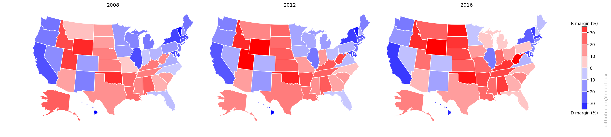
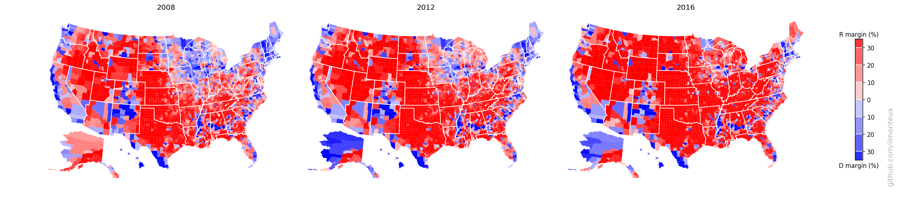
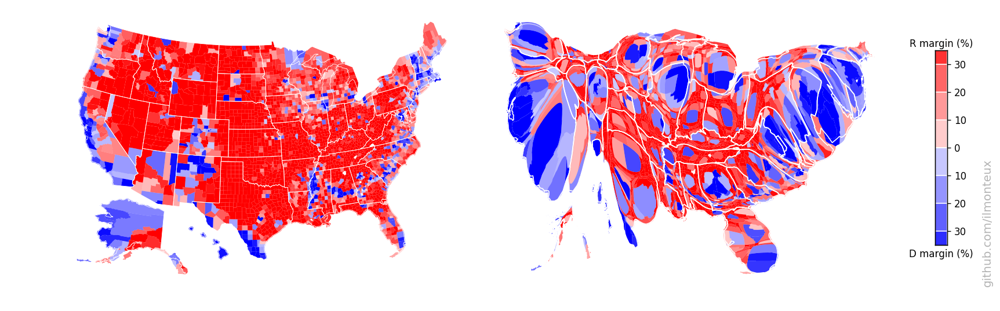

# Analyzing and plotting US election results

This is a short walkthrough of the Jupyter notebook [election_maps.ipynb](election_maps.ipynb). Head over there to see the gritty details.

The purpose of this exercise is to generate state and county level maps interpreting the 2016 US election results. In addition to just displaying the map of the US, I will also distort it to reflect the fact that most red states are very desert, which will give a better idea of where the voters are.

First, I will import the dataset which contains county-level election results, demographics and coordinates for county borders. As explained in the [README](README.md), this is not my own work, instead all the thanks go to the [New York Times](https://www.nytimes.com/elections/results/president), to  [deleetdk on github](https://github.com/Deleetdk/USA.county.data) and to [OpenDataSoft.com](http://data.opendatasoft.com/explore/dataset/usa-2016-presidential-election-by-county@public/). The dataset is simply a JSON file:
```python
with open(os.path.join('input','usa-2016-presidential-election-by-county.json')) as f:
    data = json.load(f)
```

The level of information available is amazing, from demographics to economic data to the geometry of each county.
Because Alaska reports its election result by precinct instead of by county, the NYT (and therefore the OpenData dataset) did not include county-level data for Alaska (but we still have demographic and geometry information available). Fortunately, at [rrhelections.com](https://rrhelections.com/index.php/2018/02/02/alaska-results-by-county-equivalent-1960-2016/) they repackaged the data into county-level data. I downloaded the zip file at that link and exported separate 2008-2016 sheets to csv to easily import as pandas dataframes. For example, here is the 2016 dataframe, of which we select the relevant columns
```python
akdf = pd.read_csv(os.path.join('input','Alaska2016.csv'))
akdf = akdf.drop([len(akdf)-1]).sort_values('ED/Muni')
akdf = akdf.reset_index(drop=True )
akdf = akdf[['ED/Muni','SL Total','TotPCT Trump,N,19,10','TotPCT Clinton,N,19,10','TotPCT Johnson,N,19,10','TotPCT Stein,N,19,10']]
```

After merging the Alaska dataframe info into the `data` dictionary, we have electoral information for 3141 out of 3142 counties (or county equivalents, e.g. Alaska census areas, independent cities that are not part of a county, and Washington, DC). What is missing?  Kalawao County, Hawaii, which has a population of 139 and cast 20 votes in the 2016 elections. I could add it by hand, but why bother?

# Maps

Finally, we separately download state-level maps from the US census bureau, because insofar we only have county-level coordinates. We import it with geopandas:
```python
us_df = gpd.GeoDataFrame.from_file(os.path.join('input',"State_2010Census_DP1.dbf"))
us_df = us_df.sort_values('NAME10')
us_df = us_df.reset_index(drop=True )
```
Each state border can be very intricate as it can include tens of minor islands, which we are not interested in. For each state, I define a main border by taking the polygon enclosing the largest surface area (except for Hawaii, for which I would only get one island, and the state would not be recognizable on a map). I also shift Hawaii and Alaska so they can be displayed near the continental United States; note that Alaska is also rescaled down because it would otherwise be huge. The source code and the resulting borders are as follows:   
```python
state_border = {}
minor_borders = {}
fig, axes = plt.subplots(1,2,figsize=(12,4))
for st,borders in us_df[['STUSPS10','geometry']].itertuples(index=False):
    poly = []
    if borders.geom_type == 'MultiPolygon':
        for pol in borders: poly.append(pol)
    else:     poly.append(borders)
    # find biggest polygon
    main_pol = max( poly, key= lambda x: x.area)
    # shift and rescale Alaska
    if st=='AK': state_border[st] = np.array(map(lambda (x,y): [0.32*x-65,0.44*y], np.array(main_pol.exterior.coords.xy).T)).T
    elif st=='HI': # keep all islands for Hawaii
        hawaii_keys = []
        for ip, pol in enumerate(borders):
            hawaii_keys.append(st+str(ip))
            state_border[st+str(ip)] = list(np.array(map(lambda (x,y): [x+53,y+7], np.array(pol.exterior.coords.xy).T )).T)
    else: state_border[st] = main_pol.exterior.coords.xy
    minor_borders[st] = []
    for pol in poly:
        if pol != main_pol: minor_borders[st].append(pol.exterior.coords.xy)

    axes[0].plot(*state_border[st])
    for pol in minor_borders[st]:
        axes[1].plot(np.mod(pol[0],-360),pol[1]) # keep together AK smaller islands that go around date change line
```


We can now take the main states and color them according to how they voted, similar to the NYT color scheme, that is, red/blue with a fainter color if the election was close, and darker otherwise. The color map is implemented with a simple function
```python
def col_alpha_rescale(percentD,percentR):
    red, blue = (0., 1.) if percentD > percentR else (1.,0.)
    alpha = min(max(0.2 + (np.abs(percentD-percentR)/0.4),0),1)
    return  (red, 0, blue,alpha)
```
which returns a RGBA specification as wanted. Given the state borders defined above, and the county level borders included in `data`, we can plot with matplotlib (using Basemap to project into the standard US projection - Albers equal area):
```python
themap = Basemap(epsg=2163, llcrnrlon=-130, llcrnrlat=24, urcrnrlon=-65, urcrnrlat=50)
fig, ax = plt.subplots(1,1,figsize=(12,7.5))
for idx in counties_borders.keys():
    # fill counties with color
    red = 1.*data[idx]['fields']['votes16_trumpd']/data[idx]['fields']['total_population']
    blue = 1.*data[idx]['fields']['votes16_clintonh']/data[idx]['fields']['total_population']
    ax.fill(*themap(*np.array(counties_borders[idx]).T), facecolor=col_alpha_rescale(blue, red))

for st in cdf['STUSPS10'].tolist()+hawaii_keys+['AK']:
    ax.plot(*themap(*state_border[st]), c='w',lw=1)

ax.set_axis_off()
```

One can similarly get state-level election results. In this way I get the following maps for the 2016 elections:

 

There it is in full glory! One interesting feature is that the county-level margins are more extreme than state-level ones. Political bubbles are ubiquitous.   
These maps can be compared to previous elections, to understand the difference between the last election and the Obama 2008 and 2012 elections:

   


Even though Hillary Clinton won the popular vote, one easily sees that a bunch of states from Pennsylvania to the Midwest were flipped (the so-called Blue Wall).

# Cartograms: reflecting where people actually live
Looking at the county-level figures, one would wonder how  it was ever possible for Democrats to win any election, given that most of the US looks very red/Republican. The simple answer is that very few people live in those large swaths of red.  For example, see the distribution of vote margins by county, vs by vote total.


There are a lot of republican counties with very few people in them.
This is easily understood by making a map of the population density (left below, with darker greens corresponding to larger densities, on a log scale):


The plot on the right is a [cartogram](https://en.wikipedia.org/wiki/Cartogram), that is, a map where distance between points has been substituted by another variable, in this case population. Therefore larger population centers, such as New York and Los Angeles (but also most cities in each state), get blown up with respect to rural areas. To retain intuitive understanding of the each state, the shape is retained as much as possible.

The cartograms here are based on the Gastner-Newman algorithm  [(link to paper)](www.pnas.org/content/101/20/7499), in particular using the C++ implementation provided by one of the authors at http://www-personal.umich.edu/~mejn/cart.

Specifically, one creates a 2D grid covering the whole US in the original coordinates, and at each grid point one computes the population density (that is, the population density of the state or county in which the point falls). The goal of the algorithm is to expand all areas with above average population density and to shrink regions below average. This is achieved by Gastner and Newman by simulating a liquid flow from the high-density to the low-density areas until the density is equalized (that is, big population centers have become larger). The output of the algorithm is a new grid where each point of the original grid is shifted according to the density flow. The algorithm itself is very fast, running in around 5-10 seconds depending on grid size.

Now, we just pick the state and county borders and use bilinear interpolation from the closest grid points to find how they have shifted. Take a look at the [notebook](election_maps.ipynb) for more details, as there are several intermediate functions defined, but the last step for shifting a state border is
```python
morphed_border_county={}
for idx in counties_borders.keys():
    morphed_border_county[idx] =  np.array([ interp_cartogram(cartogrid2, cx_county, cy_county, [bb[0], bb[1]]) for bb in counties_borders[idx]])
```

The resulting maps are the following:




Note that this can be done at the state-level (top: changing the shape of the whole state assuming constant density inside) or at the county level (bottom). A simple difference in the result can be noted in the shape of NY state: at the state-level, it increases in size while roughly maintaining its shape, because the effect of NYC gets distributed over the whole state. On the other hand, at the county-level New York City and the surrounding areas (for example Long Island) get blown up while most of New York State shrinks to nothing. The same happens to California with Los Angeles, San Diego and the Bay Area.

By looking at the last figure, it is easier to understand how Democrats won the popular vote: they win elections where more people live! After all, *it is the people that vote, not the land*.

Again, one can compare the 2016 election to the previous two election cycles, but looking at the cartograms instead of the physical US map:

   


## The electoral college

As is well known, this discussion is somewhat abstract, as the president is not elected by the people, but by the Electoral College. The number of EC votes for each state reflects the number of House representatives and senators for each state, with the former being tied to the total state population. Therefore, the Electoral College map is relatively similar to the population map.

Here the Electoral College counts per state were downloaded from [Chris Taylor on github](https://github.com/chris-taylor/USElection/). I then made a cartogram for the Electoral College as well. Instead of population density, one wants to equalize the number of electoral college voters per state area (EC density). The result is the following:

   

By comparing the size of each state in the population vs the electoral college cartogram, one can see that the smallest states are gaining more representation than their population entitles them to. Still, because they have only a few votes to start with, those are not the relevant states for presidential campaigns anyway.
Here the shading is relatively unimportant, as most states are winner-take-all.

# Individual state cartograms
In the US-wide maps above, details for each state are mostly too small to discern. I can take each state individually and make a population cartogram that will show the internal shifting of counties. To make maps more recognizable, I also overlay interstate highways (from the US census [TIGER dataset](http://www2.census.gov/geo/tiger/TIGER2016/PRIMARYROADS/tl_2016_us_primaryroads.zip)).   
I found that the most logical combination of plots is to show the election results on the standard map, the population density and then the cartogram. Plots for each state are saved in the [figs/state_maps/](figs/state_maps/) subdirectory. Here are some samples:


# Looking into demographics

With all this data available, I could not stop myself from looking for correlations between election results and demographics. This is not meant to be a complete analysis of any sort, I am just picking demographic and economic data and see what happens.    
The source for this section is in [demographics.ipynb](demographics.ipynb).

First I plot the 2016 vote margin with respect to total county population, population density, whiteness of the electorate, and median income:   


Each circle represents one county, with the circle size representing the population of each county. Already mentioned trends are recognizable: population density is correlated with voting democrat, while whiteness correlates with voting republican. For example it seems that when the population is less than 40% white, it is almost impossible for a county to vote republican. It does not seem that median income is a factor.

Before jumping to conclusions, we can look for correlation in these variables:


There is definitely a correlation between population density, white %, and democratic vote. For example the aforementioned limit of 40% in whiteness also shows as a limit on population density: it is extremely hard for republicans to win any county with population densities above 1000 people per square mile. On the other hand there are also diverse sparsely populated areas that consistently vote democrat, but they are mostly non-white.

Remembering the old mantra that correlation does not imply causation, it would seem hard to assert (based on data) that whiteness is a deciding factor in voting republican. On the other hand, given the positions of the republican party on minorities, it is still plausible, and the data shows that in *minority-majority* places, democrats have the upper hand.

Finally, we can compare the 2016 election to previous presidential elections. The simplest measure is the percent *shift*, that is, the difference between the margins in the various elections. The blue/red colors are still based on the 2018 results.


The data here could be slightly misleading about overall trends: after Obama's historic 2008 elections, democratic votes have been steadily going down (as usual, the party in power loses votes).
