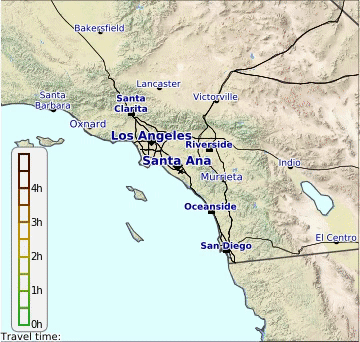
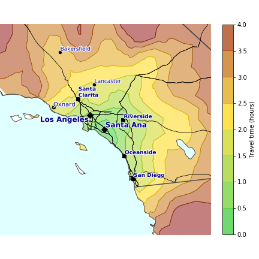
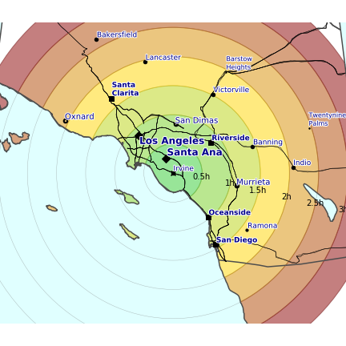
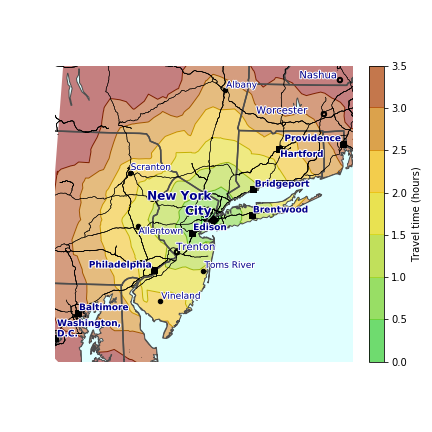
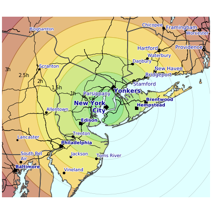

# Chronomaps: maps of travel times instead of distances

## Summary
People use maps everyday, either directly with GPS navigation, route-planning on public transportation and so on, or indirectly when they have memorized routes around home, work, etc.. 

The purpose of a normal map in most cases is to give a pictorial representation of what will be turn-by-turn directions which is easy to follow by eye  (which obviously measure distance, not time). 

But for the most part, people do not care about *distances* as much as they care about *travel times* from one place to another. How long will it take me to get to work? To the grocery store? To the movie theater? To my grandma's house upstate? Across the country?

A different kind of map would be one where a segment length on the map reflects travel times instead of distances. I called this tye of map a **chronomap** (from *chronos*=time). In this project, I developed this concept and applied it to several cities across the United States. See here an animation of a transition between a normal map and the corresponding chronomap:

All the required code (in Python) is provided and anyone is welcome to use it as they wish. A detailed walkthrough of the Jupyter notebooks, with many more intermediate plots, is provided at [ilmonteux.github.io/chronomaps](ilmonteux.github.io/chronomaps). If you do something with this work and publish it (on GitHub or elsewhere), I would be glad to know, so send me a note.

## Details and links
The Google Maps Matrix Distance API can answer the age-old question of *"How long will it take me to go from HERE to THERE?"* in fractions of a second, and anyone's smartphone can direct them almost anywhere with little input (not trying to do lip service to Google, as Apple Maps, Bing and OpenStreetMap can do the same).

First we compute fixed time contours, technically known as [isochrones](http://en.wikipedia.org/wiki/Isochrone_map), from a given start location. This is a feature I have found useful when exploring a map but trying not to drive too much (e.g. to go for a hiking trip while being flexible about the final destination).

I create a (latitude, longitude) grid surrounding a given starting location and then call the API to calculate travel distances from the starting point to each of these points. To compute the isochrones, I simply make a contour plot of the resulting travel times at given intervals.

Then, I made what I called ***chronomaps***, that is, maps where the radial distance from a central location is not given by the geographical coordinates but instead by travel time coordinates.

The work is done in the following python Jupyter notebooks:

- [travel times.ipynb](travel%20times.ipynb): call Google Maps API to compute travel times around a given location. In the notebook we first generate travel time grids around Irvine, CA, and then in a batch run around a hand-picked set of US cities (San Francisco, Seattle, Denver, Chicago, Washington DC, New York). Here I draw isochrones on top of map backgrounds from the ArcGIS ESRI service.

- [chronomaps.ipynb](chronomaps.ipynb): load the travel time grids to first draw isochrones and then chronomaps around each of the same cities. The resulting figures are as follow (here I compare standard maps to chronomaps):    

    

    

By construction, the isochrones (points at a fixed travel time from the origin point) on a chronomap are circles around the origin.

- [us_chronomap.ipynb](us_chronomap.ipynb): compute isochrones and chronomaps for the whole (continental) United States, starting from three points:

	- New York City, NY
	- Los Angeles, CA
	- The geographic center of the contiguous US (which is near Lebanon, Kansas).   
	 
    > notebook and figures coming soon

### Prerequisites
All packages can be loaded in your `conda` environment by loading [requirements.txt](requirements.txt).

To generate and plot the data, I have mostly used common packages:    
- `urlparse`, `urllib2`, `ConfigParser` `simplejson` for querying  Google Maps API and loading the results.    
- `matplotlib`, `numpy`, `geopandas`, `shapely.geometry` for importing, data manipulation and plotting.    
- `mpl_toolkits.basemap` for projecting latitude/longitude coordinates into projection coordinates, and for downloading map tiles via arcgis REST API and the ESRI Street World Map database.    
- `scipy.interpolate` for making smooth chronomaps from the noisy Google Maps dataset.    
- finally `ffmpeg`, has been used to save the animations to .gif and .mp4 files, as well as to convert in between them. They are not strictly necessary apart from saving the animations output.

## Author
* **Angelo Monteux** - [ilmonteux](https://github.com/ilmonteux)

## Acknowledgments
This project was inspired by the *isocronut* package by [drewfustin](https://github.com/drewfustin/isocronut/). In particular the walkthrough at [drewfustin.com/isochrones/](drewfustin.com/isochrones/) was great to learn how to use the Google Maps Matrix Distance API. Most of the API calls come straight from there.

While working on the chronomaps portion, I found [this timeMaps project by Vincent Meertens](
http://www.vincentmeertens.com/project/timemaps/) that was doing exactly what I wanted (except, for the Netherlands based on public transportation travel times). The figures and video look great, but the website is not live anymore (it was made in 2011...), and there is no documentation on how the maps were actually made.

So I decided to keep going on with my project and develop a fully reproducible pipeline, from data acquisition through the Google Maps API to making the chronomaps themselves. It would be nice to have an interactive website like his, but it is beyond my knowledge base so far. Feel free to get in touch/make a pull request if you have time and know how to do this!