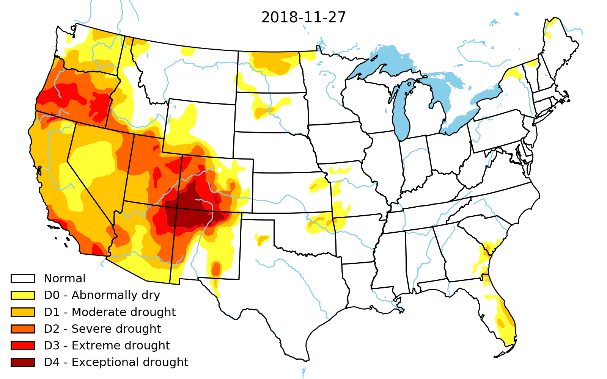

# my US drought monitor

Data visualization of drought conditions in the United States. Head to my [github Pages blog post](https://ilmonteux.github.io/2018/12/03/drought-maps.html) for animations, more details and a tutorial, or to the [Jupyter notebook](drought maps.ipynb) to reproduce the results.

### Prerequisites
- `matplotlib` for plots and animations (saved with `ffmpeg`).
- `pandas`, `geopandas`, `shapely` for analysis and geospatial tools.
- `requests`, `urllib`, `BeautifulSoup`, `zipfile` for parsing website, download data and unzip it.

## Author
* **Angelo Monteux** - [ilmonteux](https://github.com/ilmonteux)

## Acknowledgments
This project was inspired by the maps at the [US drought monitor](https://droughtmonitor.unl.edu/) by  Richard Heim, NOAA/NCEI. Head over there for a cool interactive website.

