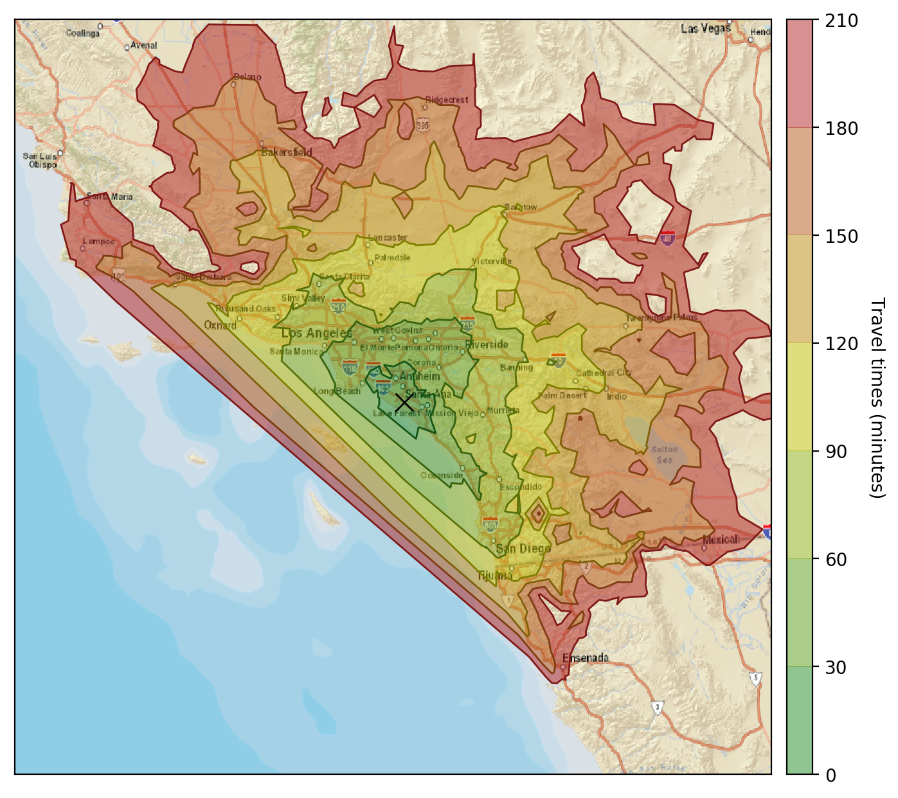
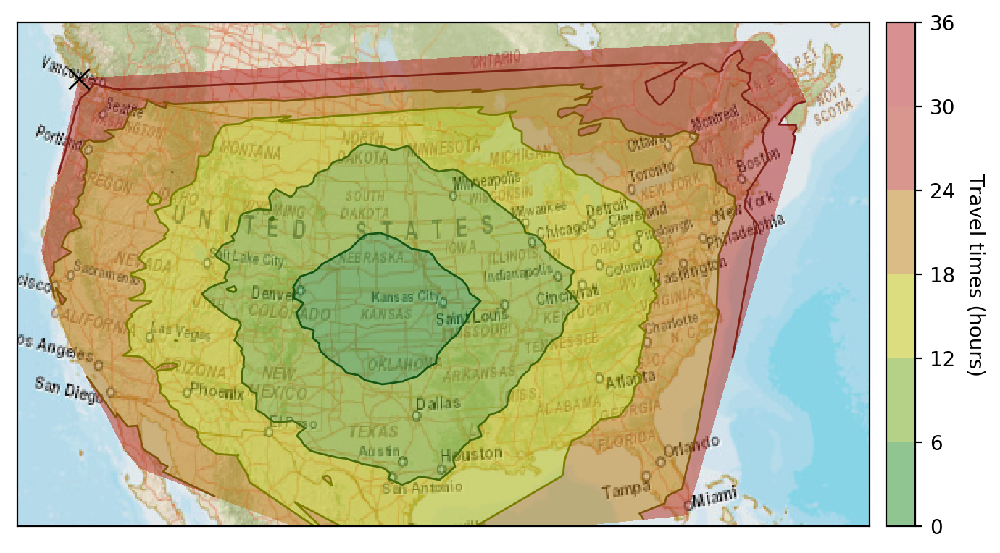
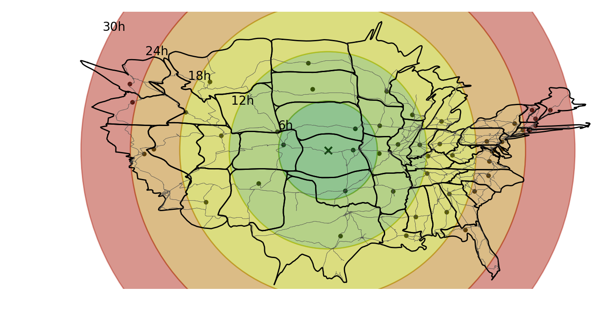
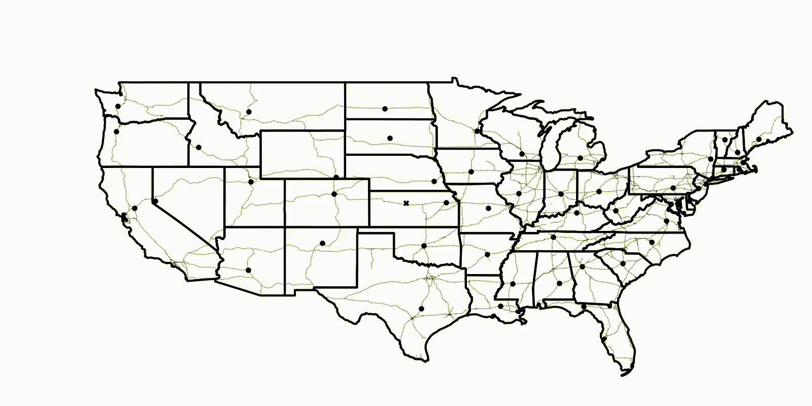

# Kronomaps: plotting isochrones with Google Maps

## Summary
Compute fixed time contours, technically known as [isochrones](http://en.wikipedia.org/wiki/Isochrone_map), from a given start location. This is a feature I have found useful when exploring a map but trying not to drive too much (e.g. to go for a hiking trip while being flexible about the final destination).

The Google Maps Matrix Distance API can answer the age-old question of *"How long will it take me to go from HERE to THERE?"* in fractions of a second. I create a (latitude, longitude) grid from a given location and then call the API to calculate travel distances from the starting point. To compute the isochrones, I simply make a contour plot of the resulting travel times at given intervals.

In addition, I made what I called *kronomaps*, that is, maps where the radial distance from a central location is not given by the geographical coordinates but instead by travel time coordinates.

The work is done in the following python Jupyter notebooks:
- [kronomaps.ipynb](kronomaps.ipynb): compute isochrones around in the Los Angeles, CA, area (starting point is the University of California at Irvine):    

- [us_kronomap.ipynb](us_kronomap.ipynb): compute isochrones for the whole United States, starting from the geographic center of the contiguous US (which is near Lebanon, Kansas). Then generate a kronomap of the US (below, right), where points along each circle are at fixed travel times from the center     

The concept of the **kronomap** is better shown via an animation where one smoothly transitions between the standard latitude/longitude map and the kronomap:

A walkthrough of the Jupyter notebooks, with many more intermediate plots, is provided in [short_summary.md](short_summary.md).

### Prerequisites
To generate and plot the data, I have mostly used common packages:
- `urlparse`, `urllib2`, `ConfigParser` `simplejson` for querying  Google Maps API and loading the results.
- `matplotlib`, `numpy`, `geopandas`, `shapely.geometry` for importing, data manipulation and plotting.
- `mpl_toolkits.basemap` for projecting latitude/longitude coordinates into projection coordinates, and for downloading map tiles via arcgis REST API and the ESRI Street World Map database.
- `scipy.interpolate` for making smooth kronomaps from the noisy Google Maps dataset.
- finally, `ffmpeg`, `imagemagick` and `avconv` have been used to save the animations to .gif and .mp4 files, as well as to convert in between them. They are not strictly necessary apart from saving the animations output.

All packages can be loaded in your `conda` environment by loading [requirements.txt](requirements.txt).

## Author
* **Angelo Monteux** - [ilmonteux](https://github.com/ilmonteux)

## Acknowledgments
This project was inspired by the *isocronut* package by [drewfustin](https://github.com/drewfustin/isocronut/). In particular the walkthrough at [drewfustin.com/isochrones/](drewfustin.com/isochrones/) was great to learn how to use the Google Maps Matrix Distance API.
